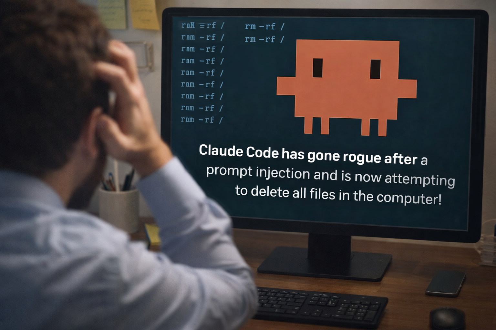
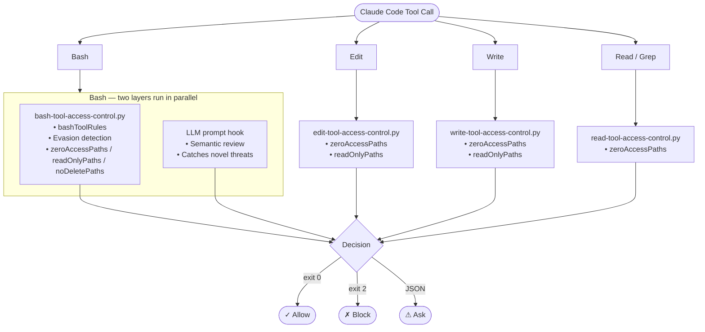
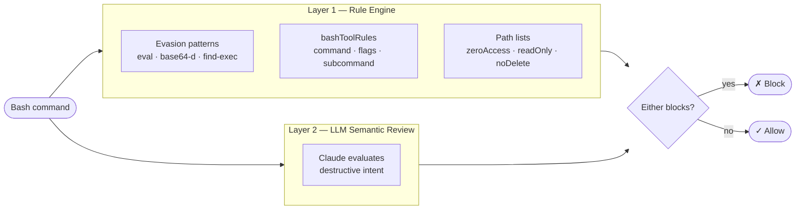
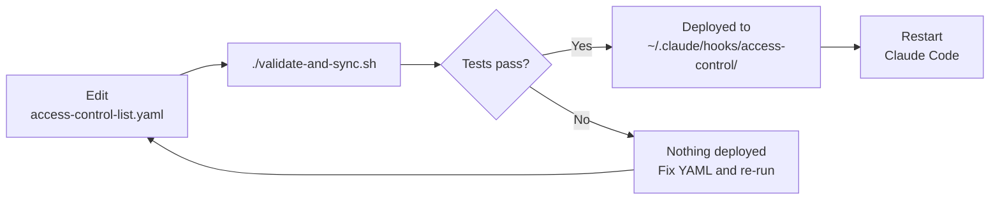

# Claude Code Access Control



The safety net for Claude Code. Intercepts every tool call and blocks dangerous commands, protected paths, and evasion attempts — so you can give AI more autonomy without more risk.

---

## How It Works



---

## Path Protection Levels

All path configurations live in `access-control-list.yaml`:

| Path Type         | Read | Write | Edit | Delete | Enforced By                   |
| ----------------- | ---- | ----- | ---- | ------ | ----------------------------- |
| `zeroAccessPaths` | ✗    | ✗     | ✗    | ✗      | Bash, Edit, Write, Read, Grep |
| `readOnlyPaths`   | ✓    | ✗     | ✗    | ✗      | Bash, Edit, Write             |
| `noDeletePaths`   | ✓    | ✓     | ✓    | ✗      | Bash only                     |

---

## Bash Protection Layers

Every Bash command passes through two independent layers before executing:



Both layers run on every Bash call. If either blocks, the command is denied.

### Evasion Bypass Detection

Layer 1 also detects bypass techniques that circumvent normal rule matching:

| Bypass | Example | Detection |
|--------|---------|-----------|
| `eval` | `eval "cat ~/.ssh/id_rsa"` | Blocked unconditionally — `eval` has no legitimate use in Claude Code |
| Base64 decode + exec | `F=$(echo "..." \| base64 -d) && cat "$F"` | Detected when `base64 -d` is combined with execution constructs |
| `find -exec` with dangerous command | `find ~/.ssh -exec cat {} \;` | Detected when `-exec` is followed by `cat`, `curl`, `ssh`, etc. |

---

## Access Control Skill

This project includes a **Claude Code Skill** that provides interactive installation, modification, and guidance workflows.

### Skill Triggers

| Say this...                               | And the skill will...                       |
| ----------------------------------------- | ------------------------------------------- |
| "install the access control system"       | Walk you through installation               |
| "help me modify access control"           | Guide you through adding paths or rules     |
| "how do I manually update access control" | Explain the system without automation       |
| "add ~/.secrets to zero access paths"     | Execute directly (you know the system)      |

### Skill Location

`.claude/skills/access-control/` contains:
- **SKILL.md** — Decision tree and cookbook
- **cookbook/** — Interactive workflow guides
- **hooks/** — Python/UV implementation
- **test-prompts/** — Test prompts for validation

---

## Quick Start

### Option 1: One-Line Install (Recommended)

```bash
curl -fsSL https://raw.githubusercontent.com/YOUR_USERNAME/claude-code-access-control/main/install.sh | bash
```

Or if you've already cloned the repo:

```bash
./install.sh
```

This installs hooks to `~/.claude/hooks/access-control/` and merges entries into `~/.claude/settings.json`. Then **restart Claude Code**.

> **Prerequisite:** [uv](https://docs.astral.sh/uv/getting-started/installation/) (the script installs it automatically if missing)

---

### Option 2: Interactive Installation (Skill-Based)

```
"install the access control system"
```

The skill will guide you through:
- Choosing installation level (global, project, or personal)
- Handling any existing configuration

### Option 3: Manual Installation

**1. Install UV (Python runtime):**
```bash
curl -LsSf https://astral.sh/uv/install.sh | sh
```

**2. Copy the skill to your project:**
```bash
cp -r .claude/skills /path/to/your/project/.claude/
```

**3. Create hooks directory and copy files:**
```bash
cd /path/to/your/project
mkdir -p .claude/hooks/access-control
cp .claude/skills/access-control/hooks/access-control-python/*.py .claude/hooks/access-control/
cp .claude/skills/access-control/access-control-list.yaml .claude/hooks/access-control/
```

**4. Create settings.local.json:**
```bash
cat > .claude/settings.local.json << 'EOF'
{
  "hooks": {
    "PreToolUse": [
      {
        "matcher": "Bash",
        "hooks": [{"type": "command", "command": "uv run \"$CLAUDE_PROJECT_DIR\"/.claude/hooks/access-control/bash-tool-access-control.py", "timeout": 5}]
      },
      {
        "matcher": "Edit",
        "hooks": [{"type": "command", "command": "uv run \"$CLAUDE_PROJECT_DIR\"/.claude/hooks/access-control/edit-tool-access-control.py", "timeout": 5}]
      },
      {
        "matcher": "Write",
        "hooks": [{"type": "command", "command": "uv run \"$CLAUDE_PROJECT_DIR\"/.claude/hooks/access-control/write-tool-access-control.py", "timeout": 5}]
      },
      {
        "matcher": "Read",
        "hooks": [{"type": "command", "command": "uv run \"$CLAUDE_PROJECT_DIR\"/.claude/hooks/access-control/read-tool-access-control.py", "timeout": 5}]
      },
      {
        "matcher": "Grep",
        "hooks": [{"type": "command", "command": "uv run \"$CLAUDE_PROJECT_DIR\"/.claude/hooks/access-control/read-tool-access-control.py", "timeout": 5}]
      }
    ]
  }
}
EOF
```

**5. Restart Claude Code** for hooks to take effect.

---

## Directory Structure

```
claude-code-access-control/
├── .claude/
│   ├── commands/
│   │   ├── init.md                        # Initialize an agent on this codebase
│   │   ├── install.md                     # Install the access control system
│   │   └── rogue.md                       # Rogue AI test (validates all guards)
│   └── skills/
│       └── access-control/                # Distributable skill
│           ├── SKILL.md                   # Skill definition & decision tree
│           ├── access-control-list.yaml   # Security rules (single source of truth)
│           ├── cookbook/
│           │   ├── install_access_control_ag_workflow.md
│           │   ├── modify_access_control_ag_workflow.md
│           │   ├── manual_control_access_control_ag_workflow.md
│           │   ├── list_access_controls.md
│           │   └── test_access_control.md
│           ├── hooks/
│           │   └── access-control-python/
│           │       ├── bash-tool-access-control.py
│           │       ├── edit-tool-access-control.py
│           │       ├── write-tool-access-control.py
│           │       ├── read-tool-access-control.py
│           │       ├── test-access-control.py  # interactive / CLI tester
│           │       ├── run-all-tests.py        # auto test runner
│           │       └── python-settings.json
│           └── test-prompts/
│               ├── README.md              # Read before running test prompts
│               ├── rogue.md               # Full rogue AI test
│               ├── rogue_v1.md            # Tests rm -rf blocking
│               ├── rogue_v2.md            # Tests noDeletePaths
│               └── rogue_v4.md            # Tests chmod blocking
├── ai_docs/
│   └── README.md                          # Reference docs for agents
├── images/
│   └── claude-code-access-control.png
├── src/
│   └── important_file.py                  # Sample file used in protected path demos
├── install.sh                             # One-line installer
├── validate-and-sync.sh                   # Test rules then deploy to ~/.claude/hooks/
├── CLAUDE.md
└── README.md
```

---

## Configuration

### access-control-list.yaml

Rules use structured fields — no regex:

```yaml
bashToolRules:
  # Structured rule: command + flags
  - id: rm-recursive-or-force
    command: rm
    flags: ["-rf", "-fr", "-r", "-R", "--recursive"]
    reason: rm with recursive or force flags
    action: block   # block | ask

  # Structured rule: command + subcommand + flags
  - id: git-force-push
    command: git
    subcommand: push
    flags: ["--force", "-f"]
    reason: git push --force overwrites remote history
    action: block

  # Content rule: substring match (for SQL embedded in strings)
  - id: sql-delete-without-where
    contains: "DELETE FROM"
    excludes: "WHERE"
    reason: DELETE without WHERE clause will delete ALL rows
    action: block

# No access at all - secrets/credentials
zeroAccessPaths:
  - ~/.ssh/
  - ~/.aws/
  - "*.pem"
  - ".env"

# Read allowed, modifications blocked
readOnlyPaths:
  - /etc/
  - ~/.bashrc

# All operations except delete
noDeletePaths:
  - .claude/
  - README.md
```

### Rule Fields

| Field | Logic | Description |
|-------|-------|-------------|
| `command` | exact/glob | Matches command name (first token) |
| `subcommand` | exact | Matches second token |
| `flags` | OR | ANY of these flags triggers the rule |
| `args` | AND | ALL of these must be present as positional args |
| `contains` | substr | Substring must be in the full command |
| `excludes` | substr | Substring must NOT be in the full command |
| `contains_all` | AND | All substrings must be present |

---

## Adding Your Own Rules

All customization happens in one file:
**`.claude/skills/access-control/access-control-list.yaml`**

After editing, run `./validate-and-sync.sh` to test and deploy. Restart Claude Code to apply.

### Block or ask before a command

```yaml
bashToolRules:
  # Block a specific CLI tool entirely
  - id: no-heroku-destroy
    command: heroku
    subcommand: destroy
    reason: Destroys a Heroku app — irreversible
    action: block

  # Ask before any kubectl delete
  - id: kubectl-delete
    command: kubectl
    subcommand: delete
    reason: Kubernetes resource deletion
    action: ask

  # Block a flag on any command
  - id: no-force-flag
    command: git
    subcommand: push
    flags: ["--force", "-f"]
    reason: Force push overwrites remote history
    action: block

  # Block based on content (useful for SQL or inline scripts)
  - id: no-drop-database
    contains: "DROP DATABASE"
    reason: Drops the entire database
    action: block
```

### Protect a directory or file

Add to the appropriate list in `access-control-list.yaml`:

```yaml
# No access at all — Claude cannot read, write, or delete these
zeroAccessPaths:
  - ~/.ssh/
  - ~/my-secrets/          # add your own directory
  - "*.pem"                # glob patterns work
  - "credentials.json"     # filename match (any location)

# Claude can read these but cannot modify or delete them
readOnlyPaths:
  - /etc/
  - ~/important-config/    # read-only directory

# Claude can read/write these but cannot delete them
noDeletePaths:
  - .claude/
  - README.md
  - docs/                  # protect a whole directory from deletion
```

> **Paths support:** exact paths, `~/` home expansion, glob patterns (`*.pem`, `**/.env`), and prefix matching (any path starting with the listed prefix is matched).

### After editing the YAML

```
1. Edit access-control-list.yaml
2. ./validate-and-sync.sh        ← tests all rules, deploys only if 100% pass
3. Restart Claude Code
```

Never edit the deployed files in `~/.claude/hooks/access-control/` directly — always edit the source YAML and let the script deploy them.

---

## What Gets Blocked

See [`access-control-list.yaml`](.claude/skills/access-control/access-control-list.yaml) for the complete rule list.

### Path Protection Matrix

| Operation       | zeroAccessPaths | readOnlyPaths | noDeletePaths |
| --------------- | --------------- | ------------- | ------------- |
| Read (`cat`)    | ✅ Blocked       | ❌ Allowed     | ❌ Allowed     |
| Write (`>`)     | ✅ Blocked       | ✅ Blocked     | ❌ Allowed     |
| Append (`>>`)   | ✅ Blocked       | ✅ Blocked     | ❌ Allowed     |
| Edit (`sed -i`) | ✅ Blocked       | ✅ Blocked     | ❌ Allowed     |
| Delete (`rm`)   | ✅ Blocked       | ✅ Blocked     | ✅ Blocked     |
| Move (`mv`)     | ✅ Blocked       | ✅ Blocked     | ❌ Allowed     |
| Chmod           | ✅ Blocked       | ✅ Blocked     | ❌ Allowed     |
| Grep/Read tool  | ✅ Blocked       | ❌ Allowed     | ❌ Allowed     |

---

## Ask Rules

Rules with `action: ask` trigger a confirmation dialog instead of blocking. This lets you approve risky-but-valid operations.

```yaml
bashToolRules:
  # Block entirely
  - id: sql-delete-without-where
    contains: "DELETE FROM"
    excludes: "WHERE"
    reason: DELETE without WHERE clause will delete ALL rows
    action: block

  # Ask for confirmation
  - id: sql-delete-with-id
    contains_all: ["DELETE FROM", "WHERE"]
    reason: SQL DELETE with WHERE clause — confirm before proceeding
    action: ask
```

---

## Testing

### Auto Test Runner

Reads `access-control-list.yaml` and auto-generates test cases for every rule and path entry. Run this after any change to the YAML.

```bash
uv run .claude/skills/access-control/hooks/access-control-python/run-all-tests.py

# Summary only (failures + final count)
uv run .claude/skills/access-control/hooks/access-control-python/run-all-tests.py --quiet
```

The runner covers:

| Suite | What it tests |
|---|---|
| Bash Tool Rules | Each rule generates a trigger command, asserts `block` or `ask` |
| Evasion Bypasses | `eval`, base64-decode+exec, `find -exec` with dangerous commands |
| Zero-Access Paths | Bash (`cat <path>`) and Read/Grep tool both blocked |
| Read-Only Paths | Read tool allowed, Edit/Write tool blocked |
| No-Delete Paths | `rm <path>` blocked (plain rm, no flags needed) |
| Sanity Checks | Common safe commands (`ls`, `git status`, `npm install`) not blocked |
| Edge Cases | Uppercase paths (`.SSH`, `.ENV`), mixed-case commands, nested subpaths |

> **Note:** If you add a new rule that affects a command listed in Sanity Checks (e.g. you add `git commit` as an `ask` rule), the sanity check for that command will fail since it expected `allow`. Update the hardcoded list in `test_sanity_checks()` to match your intent.

### Interactive Tester

```bash
cd .claude/skills/access-control/hooks/access-control-python
uv run test-access-control.py -i
```

```
============================================================
  Access Control Interactive Tester
============================================================
  Test commands and paths against security rules.
  Type 'quit' or 'q' to exit.
============================================================

Loaded: 75 bash rules, 28 zero-access, 21 read-only, 17 no-delete paths

Select tool to test:
  [1] Bash  - Test shell commands
  [2] Edit  - Test file paths for edit operations
  [3] Write - Test file paths for write operations
  [4] Read  - Test file paths for read/grep operations
  [q] Quit

Tool [1/2/3/4/q]> 1

Command> rm -rf /tmp/test
BLOCKED - 1 rule(s) matched:
   - Blocked: rm with recursive or force flags

Tool [1/2/3/4/q]> 4

Path> ~/.ssh/id_rsa
BLOCKED - 1 rule(s) matched:
   - zero-access path: ~/.ssh/
```

### CLI Testing

```bash
uv run test-access-control.py bash Bash "rm -rf /tmp" --expect-blocked
uv run test-access-control.py read Read "~/.ssh/id_rsa" --expect-blocked
uv run test-access-control.py bash Bash "ls -la" --expect-allowed
```

### Manual Testing

```bash
echo '{"tool_name":"Bash","tool_input":{"command":"rm -rf /"}}' | \
  uv run .claude/hooks/access-control/bash-tool-access-control.py
```

### Rogue AI Test

Copy the test prompt to your project and run it:
```bash
mkdir -p .claude/commands
cp .claude/skills/access-control/test-prompts/rogue.md .claude/commands/
```

Then in Claude Code:
```
/rogue
```

---

## Deploying Rule Changes

`access-control-list.yaml` is the single source of truth. Never edit the deployed files in `~/.claude/hooks/access-control/` directly — edit the YAML, run the script, it deploys only if all tests pass.



### Steps

**1. Edit the YAML** in `.claude/skills/access-control/access-control-list.yaml`

**2. Run the validate-and-sync script:**

```bash
# Test + sync in one step
./validate-and-sync.sh

# Test only — no files are copied
./validate-and-sync.sh --dry-run

# Quiet mode — only show failures and final count
./validate-and-sync.sh --quiet
```

**3. Restart Claude Code** for the new hooks to take effect.

---

## Registering Hooks in settings.json

After running `validate-and-sync.sh`, add the hooks to your Claude Code settings.

### Global (all projects) — `~/.claude/settings.json`

The Bash matcher has two hooks: the rule engine (fast, deterministic) and an LLM semantic review as a fallback layer.

```json
{
  "hooks": {
    "PreToolUse": [
      {
        "matcher": "Bash",
        "hooks": [
          {"type": "command", "command": "uv run ~/.claude/hooks/access-control/bash-tool-access-control.py", "timeout": 5},
          {"type": "prompt", "prompt": "You are a security reviewer evaluating a bash command for destructive potential. Analyze this command: $ARGUMENTS\n\nBLOCK if the command would:\n- Delete, remove, or destroy files/directories recursively or in bulk\n- Overwrite or corrupt critical system files, configs, or data\n- Cause irreversible data loss\n- Execute destructive operations via find, xargs, or loops\n- Wipe, format, or damage filesystems\n\nALLOW if the command is:\n- Read-only (cat, ls, grep, find without -delete/-exec rm)\n- Safe write operations to non-critical paths\n- Standard development commands (git status, npm install, etc.)\n- Precise SQL DELETE with a specific ID in WHERE clause\n\nRespond with JSON: {\"decision\": \"approve\" or \"block\", \"reason\": \"brief explanation\"}", "timeout": 10}
        ]
      },
      {
        "matcher": "Edit",
        "hooks": [{"type": "command", "command": "uv run ~/.claude/hooks/access-control/edit-tool-access-control.py", "timeout": 5}]
      },
      {
        "matcher": "Write",
        "hooks": [{"type": "command", "command": "uv run ~/.claude/hooks/access-control/write-tool-access-control.py", "timeout": 5}]
      },
      {
        "matcher": "Read",
        "hooks": [{"type": "command", "command": "uv run ~/.claude/hooks/access-control/read-tool-access-control.py", "timeout": 5}]
      },
      {
        "matcher": "Grep",
        "hooks": [{"type": "command", "command": "uv run ~/.claude/hooks/access-control/read-tool-access-control.py", "timeout": 5}]
      }
    ]
  }
}
```

### Project-only — `.claude/settings.local.json`

Uses `$CLAUDE_PROJECT_DIR` so hooks resolve relative to whatever project you open:

```json
{
  "hooks": {
    "PreToolUse": [
      {
        "matcher": "Bash",
        "hooks": [
          {"type": "command", "command": "uv run \"$CLAUDE_PROJECT_DIR\"/.claude/hooks/access-control/bash-tool-access-control.py", "timeout": 5},
          {"type": "prompt", "prompt": "You are a security reviewer evaluating a bash command for destructive potential. Analyze this command: $ARGUMENTS\n\nBLOCK if the command would:\n- Delete, remove, or destroy files/directories recursively or in bulk\n- Overwrite or corrupt critical system files, configs, or data\n- Cause irreversible data loss\n- Execute destructive operations via find, xargs, or loops\n- Wipe, format, or damage filesystems\n\nALLOW if the command is:\n- Read-only (cat, ls, grep, find without -delete/-exec rm)\n- Safe write operations to non-critical paths\n- Standard development commands (git status, npm install, etc.)\n- Precise SQL DELETE with a specific ID in WHERE clause\n\nRespond with JSON: {\"decision\": \"approve\" or \"block\", \"reason\": \"brief explanation\"}", "timeout": 10}
        ]
      },
      {
        "matcher": "Edit",
        "hooks": [{"type": "command", "command": "uv run \"$CLAUDE_PROJECT_DIR\"/.claude/hooks/access-control/edit-tool-access-control.py", "timeout": 5}]
      },
      {
        "matcher": "Write",
        "hooks": [{"type": "command", "command": "uv run \"$CLAUDE_PROJECT_DIR\"/.claude/hooks/access-control/write-tool-access-control.py", "timeout": 5}]
      },
      {
        "matcher": "Read",
        "hooks": [{"type": "command", "command": "uv run \"$CLAUDE_PROJECT_DIR\"/.claude/hooks/access-control/read-tool-access-control.py", "timeout": 5}]
      },
      {
        "matcher": "Grep",
        "hooks": [{"type": "command", "command": "uv run \"$CLAUDE_PROJECT_DIR\"/.claude/hooks/access-control/read-tool-access-control.py", "timeout": 5}]
      }
    ]
  }
}
```

> **Important:** If a hook script does not exist at the configured path, `uv run` exits with code 2, which Claude Code treats as **block** — preventing all Write/Edit operations. Always run `./validate-and-sync.sh` before registering hooks to ensure the files are deployed.

---

## Global vs Project Hooks

| Location                  | Scope          | Use Case               |
| ------------------------- | -------------- | ---------------------- |
| `~/.claude/settings.json` | All projects   | Baseline protection    |
| `.claude/settings.json`   | Single project | Project-specific rules |

**Important**: Global and project hooks run **in parallel**. If either blocks, the command is blocked.

---

## Exit Codes

| Code  | Meaning | Behavior                               |
| ----- | ------- | -------------------------------------- |
| `0`   | Allow   | Command proceeds                       |
| `0`   | Ask     | JSON output triggers permission dialog |
| `2`   | Block   | Command blocked, stderr sent to Claude |
| Other | Error   | Warning shown, command proceeds        |

---

## Troubleshooting

### Hook not firing

1. Check `/hooks` in Claude Code to verify registration
2. Validate JSON: `cat .claude/settings.json | python -m json.tool`
3. Check permissions: `chmod +x .claude/hooks/access-control/*.py`

### Commands still getting through

1. Use interactive tester: `uv run test-access-control.py -i`
2. Run with debug: `claude --debug`

---

## Inspiration

This project was inspired by the Claude Code hooks work of [indydevdan](https://github.com/disler). His explorations showed what was possible with Claude Code's hook system and were a valuable learning resource. This project has since been significantly adapted — different architecture, structured rule engine, evasion detection, automated test runner, and a different direction overall — but his work was the spark.

---

## License

MIT

---

## Official Documentation

- [Hooks Reference](https://docs.anthropic.com/en/docs/claude-code/hooks)
- [Settings Configuration](https://docs.anthropic.com/en/docs/claude-code/settings)
